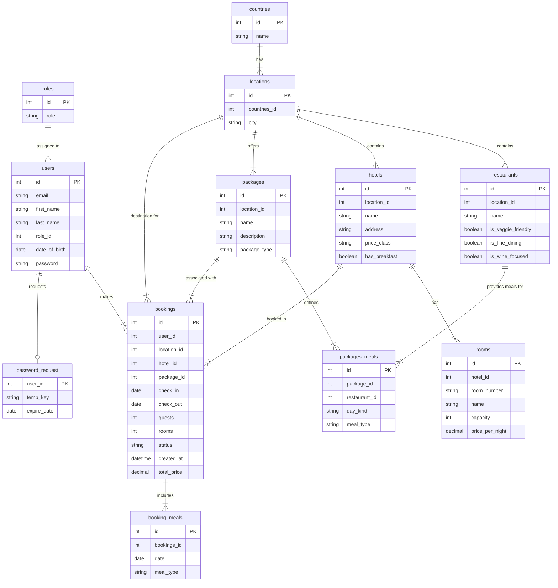

# ✈️ TravelAgency API
This is a backend project built with C# Minimal API and MySQL. The API manages bookings, hotels, rooms, travel packages, and users for a travel agency.

The project uses a custom authentication solution with Sessions and Middleware to handle roles (Admin, Client, etc.).

## 💻 Tech Stack
* **Framework:** .NET 9 (Minimal API)
* **Database:** MySQL 8.0+
* **Auth:** Custom Session Middleware
* **Testing:** Thunder Client / Postman

---

## 📋 Requirements

To run this project, you need the following installed on your computer:
1.  **C# / .NET SDK**
    * .NET 9.0 (or newer).
    * [Download here](https://dotnet.microsoft.com/download)
2.  **MySQL Server**
    * You need a local or external MySQL database running.
    * [Download here](https://dev.mysql.com/downloads/mysql/)
3.  **Code Editor**
    * Visual Studio 2022, Visual Studio Code, or Rider.
4.  **API Client** (to test endpoints)
    * Thunder Client (VS Code extension) or Postman.

---

## ⚙️ Installation & Configuration

### 1. Clone the project
Open a terminal in the folder where you want to save the project.

```bash
git clone git@github.com:GroupProjectNBI/TravelAgency1.git
```
### 2. Setup the Database (MySQL)
Open your MySQL client (e.g., MySQL Workbench or terminal) and run the following commands to create the database, user, and tables.

**Step A: Create database and user**
```sql
CREATE DATABASE travel_agency_db;

-- Replace with your desired username/password
CREATE USER 'travel_user'@'localhost' IDENTIFIED BY 'travel_password';
GRANT ALL PRIVILEGES ON travel_agency_db.* TO 'travel_user'@'localhost';
FLUSH PRIVILEGES;

USE travel_agency_db;

-- 1. Create necessary auth tables
CREATE TABLE roles (
  id INT AUTO_INCREMENT PRIMARY KEY,
  role_name VARCHAR(50) NOT NULL
);

CREATE TABLE users (
  id INT AUTO_INCREMENT PRIMARY KEY,
  email VARCHAR(100) UNIQUE NOT NULL,
  password VARCHAR(255) NOT NULL, 
  role_id INT,
  FOREIGN KEY (role_id) REFERENCES roles(id)
);

-- 2. Add roles
INSERT INTO roles (role_name) VALUES ('Admin'), ('Client');

-- 3. Create your first temporary Admin
-- IMPORTANT: If you use BCrypt in the code, the password here must be hashed.
-- The example below is 'adminpass' in plain text (if running in dev-mode without hashing).
INSERT INTO users (email, password, role_id) 
VALUES ('admin@travel.com', 'adminpass', 1);
```


### 3. Update Configuration

Open **Program.cs** and find the line where the Connection String is set. Ensure uid (username) and pwd (password) match your local MySQL installation.

C#

/.

```csharp
// I Program.cs
Config config = new("server=127.0.0.1;uid=travel_user;pwd=travel_password;database=travel_agency_db");
```
### 4. Install Dependencies (Packages)
For the project to work, you must install the MySQL connector. Run the following commands in your terminal:

```bash
# Install MySQL Data (Version 9.5.0)
dotnet add package MySql.Data --version 9.5.0
# Restore dependencies
dotnet restore
```

### 🚀 How to Run

```bash
dotnet run
```
You should see the text Now listening on: http://localhost:5xxx in the terminal.

### Initialize Travel Data (Seed)
Now that the server is running, we need to populate the database with data (Hotels, Trips, etc.).

1. Log in via /login with the temporary admin created in SQL (admin@travel.com).

2. Run Reset: Call the endpoint DELETE /db (Requires Admin role).

    This will delete everything and recreate the tables with ready-made test data.

3. Done! The temporary admin user is now gone. Use one of the users below to continue testing:


| Email | Password | Role |
| :--- | :--- | :--- |
| edvin@example.com | travelagency | Client |
| admin1@example.com | adminpass | Admin |
| admin2@example.com | adminpass | Admin |
| admin3@example.com | adminpass | Admin |
| admin4@example.com | adminpass | Admin |
| admin5@example.com | adminpass | Admin |
| user1@example.com | password | Client |
| user2@example.com | password | Client |
| user3@example.com | password | Client |
| user4@example.com | password | Client |
| user5@example.com | password | Client |
| user6@example.com | password | Client |
| user7@example.com | password | Client |
| user8@example.com | password | Client |
| user9@example.com | password | Client |

(There are more users generated, but listing these is sufficient).


### 🔐 Authentication & Endpoints

### This API uses Session-based authentication.

**Log in**: Send a POST to /login with email and password.

**If successful**: The server sets a Cookie in your browser/API client

**Access**: The Middleware (SessionAuthMiddleware) reads the cookie on every request and grants access based on your role in the database.

### Roles:

*Admin* - Full access (can reset DB, manage users).

*Client* - Can book trips and view their bookings

*Guest (Not logged in)* - Can search trips and view hotels.


## 📡 Example Endpoints 
| Metod  | Endpoint                 | Description              | Permission |
| :----- | :------------------------| :----------------------- | :--------- |
| POST   | `/register`              | Create new user          | All        |
| POST   | `/login`                 | Log in user              | All        |
| POST   | `/bookings/ from-offer`  | Book a trip              | Client     |
| PUT    | `/bookings/{id}/confirm` | Confirm a trip           | Client     |
| DELETE | `/db`                    | Reset database           | Admin      |

## 🛠 Troubleshooting
- **Error 403 Forbidden**: You are logged in but have the wrong role. (Check if the role is named "admin" or "Admin" in the database - the system is case-sensitive).

- **Database Connection Error**: Database Connection Error: Check that the MySQL server is running and that credentials in Program.cs match exactly what you created in SQL.

- **Sessions not working**:Session not working: If using Thunder Client/Postman, make sure Cookies are enabled in the settings.

## Database Model (ER Diagram)



